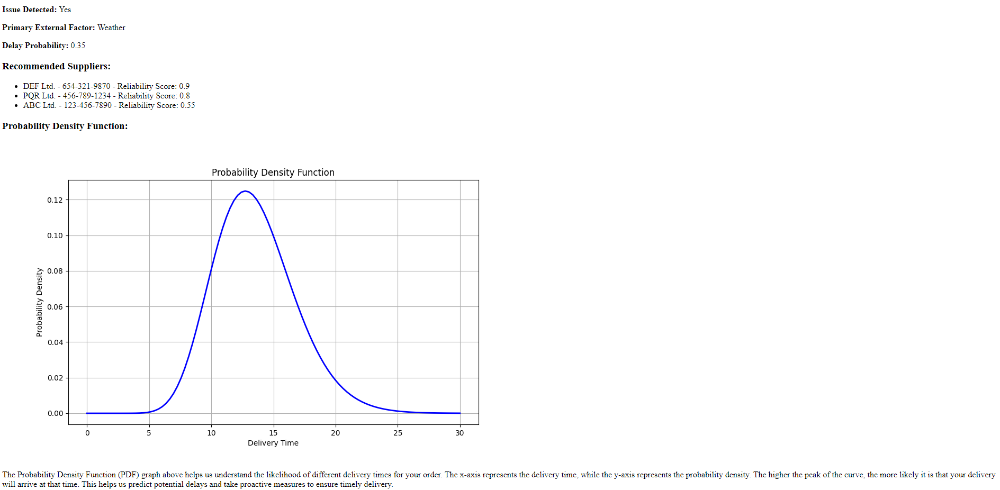
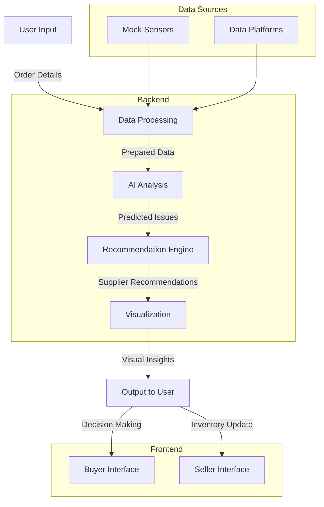

# Self learning supply chain resilience

## Overview

This is a supply chain early warning system designed to enhance the resilience of Micro, Small, and Medium Enterprises (MSMEs). This platform leverages AI-driven analytics to detect disruptions, recommend alternative suppliers, and provide actionable insights to ensure smooth operations thereby making smart decision making affordable and accessible.

## Problem Statement

MSMEs are the backbone of India's economy, contributing significantly to GDP and employment. However, they face numerous challenges in maintaining supply chain resilience, particularly in the context of the evolving digital commerce landscape. The ONDC initiative aims to democratize digital commerce by creating an open, inclusive, and competitive network. Despite this, MSMEs still struggle with:

- **Supply Chain Disruptions**: Unforeseen events like weather changes, geopolitical tensions, and market fluctuations can severely impact supply chains.
- **Lack of Predictive Insights**: Traditional supply chain management lacks the predictive capabilities needed to anticipate and mitigate disruptions.
- **Limited Access to Alternatives**: MSMEs often have limited visibility into alternative suppliers and logistical solutions.

## Solution

Our platform addresses these challenges by providing a robust AI-driven early warning system. Key features include:

- **Real-Time Monitoring**: Continuous monitoring of supply chain parameters using mock sensors and data platforms.
- **Predictive Analytics**: Using advanced models to predict the probability of disruptions and their potential impact.
- **Alternative Recommendations**: Suggesting reliable alternative suppliers with projected lead times.
- **Transparent Decision-Making**: Offering interpretable insights and visualizations to enhance trust and decision-making.

## Market Opportunity

The ONDC initiative is poised to revolutionize digital commerce in India, targeting a significant market segment:

1. **Total Addressable Market (TAM)**: The Indian retail market was valued at $950 billion in 2023, with e-commerce accounting for 10% of this market. The fashion sector alone is projected to grow to $200 billion by 2030, with online fashion contributing $36 billion. (Source: Indian Retailer, 2024)
2. **Serviceable Addressable Market (SAM)**: ONDC aims to onboard 900 million buyers and 1.2 million suppliers over the next five years, facilitating a paradigm shift in e-commerce penetration from 8% to 25%. (Sources: Indian Retailer, 2024)

## Integration with ONDC (work in progress)

### Seamless Integration with Buyers and Sellers Data

Our AI-driven system integrates seamlessly with the Open Network for Digital Commerce (ONDC) infrastructure, enabling efficient data exchange between buyers and sellers. Here’s how we ensure straightforward integration:

**Standardized APIs**: We use standardized APIs aligned with ONDC protocols, such as the Beckn Protocol, to ensure compatibility and seamless data exchange. This allows our AI system to easily access and process data from various ONDC participants.

**Data Interoperability**: Our system supports multiple data formats and structures used within the ONDC ecosystem. This ensures smooth integration of critical data such as inventory levels, order histories, and transaction details from both buyers and sellers.

**Real-Time Data Processing**: By leveraging real-time data processing capabilities, our platform provides up-to-date insights and recommendations, helping buyers and sellers make informed decisions based on the latest information available in the ONDC network.

**Customizable Integration**: We offer customizable integration options to cater to the unique needs of different buyers and sellers. This includes tailored data ingestion pipelines, configurable analytics dashboards, and flexible reporting tools.

**Secure Data Handling**: We adhere to industry-standard security protocols to protect sensitive information. Our system complies with ONDC’s data protection policies, ensuring secure and responsible data handling.

**Scalable Architecture**: Our scalable architecture ensures that the platform can grow alongside the ONDC ecosystem, efficiently handling increasing numbers of users and transactions.


## Example Output

Below is an example of the output generated by our AI-driven system for a buyer. The system provides information on detected issues, primary external factors causing the delay, recommended suppliers, and a probability density function graph to predict potential delays.

**Issue Detected:** Yes

**Primary External Factor:** Weather

**Delay Probability:** 0.55

**Recommended Suppliers:**
- DEF Ltd. - 654-321-9870 - Reliability Score: 0.9
- PQR Ltd. - 456-789-1234 - Reliability Score: 0.8
- ABC Ltd. - 123-456-7890 - Reliability Score: 0.55

**Probability Density Function:**



The Probability Density Function (PDF) graph above helps us understand the likelihood of different delivery times for your order. The x-axis represents the delivery time, while the y-axis represents the probability density. The higher the peak of the curve, the more likely it is that your delivery will arrive at that time. This helps us predict potential delays and take proactive measures to ensure timely delivery. This is just the beginning, a look into the immense potential to scale ONDC.


# ONDC Defensive AI System Design

## Overview

ONDC Defensive AI is a supply chain early warning system designed to enhance the resilience of MSMEs on the Open Network for Digital Commerce (ONDC). The system leverages AI-driven analytics to detect disruptions, recommend alternative suppliers, and provide actionable insights.

## System Architecture

The system is divided into several components, each responsible for different aspects of functionality. Here's a detailed breakdown:

### Components

1. **Frontend (User Interface)**
    - **Buyer Interface**: Allows buyers to input order details, describe supply chain issues, and receive status updates and alternative supplier recommendations.
    - **Seller Interface**: Enables sellers to update inventory levels and manage product availability.

2. **Backend (Server)**
    - **Flask Application**: Manages HTTP requests, routing, and rendering of templates.
    - **Models**: Handles AI model loading, prediction, and recommendation logic.
    - **Utilities**: Contains utility functions for data processing, visualization, and interpretation of AI model outputs.

3. **Data Sources**
    - **Mock Sensors**: Simulated sensors provide real-time data on supply chain conditions (e.g., weather, geopolitical events).
    - **Data Platforms**: Pre-collected data on suppliers, delivery times, and other relevant metrics.

### Data Flow

1. **User Input**: Buyers input order details and supply chain issues via the buyer interface.
2. **Data Processing**: The input data is processed and prepared for AI model analysis.
3. **AI Analysis**: The AI model analyzes the data to detect potential issues and predict disruption probabilities.
4. **Recommendation Engine**: Based on the AI analysis, the system recommends alternative suppliers with projected lead times.
5. **Visualization**: The system generates probability density graphs and interpretable insights to present to the user.
6. **Output**: The results, including recommendations and visualizations, are displayed to the user.

### Detailed Component Design

#### 1. Frontend

- **HTML Templates**: Use Jinja2 templates for rendering dynamic content.
- **CSS and JavaScript**: Provide styling and interactivity.

#### 2. Backend

- **Flask Routes**: Define routes for handling buyer and seller requests.
- **AI Models**: Utilize pre-trained BERT models for issue detection and recommendation.
- **Utility Functions**: Include functions for data preparation, prediction, visualization, and interpretation.

#### 3. Data Sources

- **Mock Sensor Data**: Simulated real-time data for various external factors affecting the supply chain.
- **Supplier and Delivery Data**: Historical data on supplier reliability and delivery times.

### Visualization and Interpretation

- **Probability Density Graphs**: Visualize the likelihood of supply chain disruptions.
- **Supplier Reliability Scores**: Assess and compare the reliability of alternative suppliers.
- **Interpretation Reports**: Provide detailed insights into the AI model's decision-making process.



## The mathematical behind the model

The core of the ONDC Defensive AI system leverages BERT (Bidirectional Encoder Representations from Transformers) for sequence classification. This implementation specifically uses the TFBertForSequenceClassification model from the Hugging Face Transformers library. The model is fine-tuned to classify supply chain issues based on textual descriptions.

### Mathematical Formulation

## Model Details

### AI Model: BERT for Sequence Classification

The core of the ONDC Defensive AI system leverages BERT (Bidirectional Encoder Representations from Transformers) for sequence classification. This implementation specifically uses the `TFBertForSequenceClassification` model from the Hugging Face Transformers library. The model is fine-tuned to classify supply chain issues based on textual descriptions.

### Mathematical Formulation

#### 1. Tokenization

The input text is segmented into tokens using the BERT tokenizer:

```python
tokens = BertTokenizer(input_text, return_tensors='tf', truncation=True, padding=True, max_length=128)
```

### 2. Embedding

The tokens are processed by the BERT model to generate vector representations (embeddings) that capture semantic meaning:

```python
embeddings = BERT(tokens)
```

### 3. Classification

The embeddings are fed into a fully-connected layer (DenseLayer) to compute logits (unnormalized scores) for each class (issue detected or not detected). Finally, a softmax activation function converts these logits into probabilities:

```python
logits = DenseLayer(embeddings)
probabilities = softmax(logits)
```

**Mathematical Notation:**

- \( x \): Input text sequence
- \( T \): BERT tokenizer function
- \( E \): BERT model
- \( W \): Weight matrix of the DenseLayer
- \( b \): Bias vector of the DenseLayer
- \( \sigma(z) \): Sigmoid activation function

The logits and probabilities can be expressed as:

\[ \text{logits} = W \cdot E(T(x)) + b \]

\[ \text{probabilities} = \sigma(\text{logits}) \]

### 4. Prediction

The class with the highest probability is chosen as the prediction:

```python
predicted_class = argmax(probabilities)
```

### 5. Probability Threshold Adjustment

Buyers can adjust the threshold (\( \tau \)) for issue detection. Only if the probability of an issue (\( P(\text{issue}) \)) exceeds the threshold is an issue flagged:

```python
issue_detected = { "Yes" if P(issue) >= τ else "No" }
```

### Probability Distribution

We use the gamma distribution to model delivery times and predict delay probabilities.

#### Fit Gamma Distribution:

```python
shape, loc, scale = gamma.fit(delivery_times, floc=0)
```

#### Calculate Probability Density Function (PDF):
```python
y = gamma.pdf(x, shape, loc, scale)
```

#### Calculate Delay Probability using Poisson Distribution:
```python
delay_probability = poisson.cdf(mean_delivery_time + 2, mean_delivery_time)
```

### Additional Considerations

While the provided code snippet focuses on the BERT-based classification, the text mentions the use of gamma and Poisson distributions. These distributions could be employed for separate tasks like:

**Delivery Time Modeling**: The gamma distribution might be used to model the probability density function (PDF) of delivery times, allowing for the calculation of delay probabilities.

**Optional Mathematical Notation:**

- \( t \): Delivery time
- \( \alpha \): Shape parameter of the gamma distribution
- \( \beta \): Scale parameter of the gamma distribution

The PDF of the gamma distribution can be expressed as:

\[ f(t; \alpha, \beta) = \frac{t^{\alpha-1} \cdot e^{-t/\beta}}{\beta^\alpha \cdot \Gamma(\alpha)} \]

where \( \Gamma(\alpha) \) is the gamma function.

## Installation

### Prerequisites

- Python 3.x
- Docker (optional for containerized deployment)

### Setup

1. **Clone the repository:**
   ```bash
   git clone https://github.com/yourusername/ondc-defensive-ai.git
   cd ondc-defensive-ai

## Data Files

- **suppliers.csv**: Contains information about suppliers, including location, rating, average delivery time, reliability score, maximum capacity, and other factors.
- **delivery_data.csv**: Contains historical delivery data, including order ID, product ID, supplier, delivery time, order quantity, delivery status, delay reason, and other factors.

## Docker

To run the application using Docker:

1. **Build the Docker image**:
    ```bash
    docker build -t supply-chain-alert .
    ```

2. **Run the Docker container**:
    ```bash
    docker run -p 4000:80 supply-chain-alert
    ```

## Future Work

- [ ] **B2C Business Case**: Develop features to enable consumers to choose sellers with high reliability scores, ensuring better service and satisfaction.
- [ ] **Seller Reliability Improvement**: Provide tools and insights for sellers to improve their reliability scores, such as feedback systems, performance analytics, and best practices.
- [ ] **Expand Data Sources**: Integrate additional data sources for more accurate predictions, including real-time weather data, traffic updates, and social media sentiment analysis.
- [ ] **Enhanced Predictive Models**: Incorporate more advanced machine learning models and techniques to improve prediction accuracy and reliability.
- [ ] **User Personalization**: Implement personalization features to tailor recommendations based on buyer behavior and preferences.
- [ ] **Mobile Application**: Develop a mobile app for easier access and real-time notifications for both buyers and sellers.
- [ ] **Scalability**: Ensure the platform can scale efficiently to handle increasing numbers of users and transactions.
- [ ] **Security Enhancements**: Continuously improve security measures to protect user data and ensure compliance with data protection regulations.
- [ ] **User Training and Support**: Provide comprehensive training and support resources to help users maximize the benefits of the platform.
- [ ] **API Integration**: Develop APIs for seamless integration with other e-commerce platforms and services.