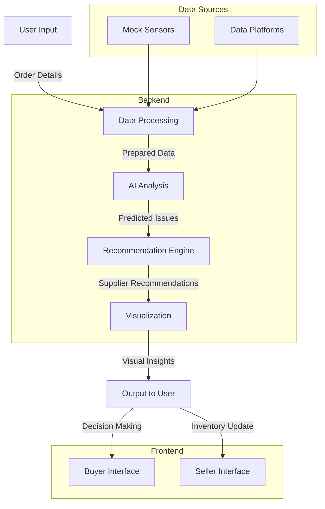

# ONDC Defensive AI

## Overview

ONDC Defensive AI is a cutting-edge supply chain early warning system designed to enhance the resilience of Micro, Small, and Medium Enterprises (MSMEs) on the Open Network for Digital Commerce (ONDC). This platform leverages AI-driven analytics to detect disruptions, recommend alternative suppliers, and provide actionable insights to ensure smooth operations thereby making smart decision making affordable and accessible.

## Problem Statement

MSMEs are the backbone of India's economy, contributing significantly to GDP and employment. However, they face numerous challenges in maintaining supply chain resilience, particularly in the context of the evolving digital commerce landscape. The ONDC initiative aims to democratize digital commerce by creating an open, inclusive, and competitive network. Despite this, MSMEs still struggle with:

- **Supply Chain Disruptions**: Unforeseen events like weather changes, geopolitical tensions, and market fluctuations can severely impact supply chains.
- **Lack of Predictive Insights**: Traditional supply chain management lacks the predictive capabilities needed to anticipate and mitigate disruptions.
- **Limited Access to Alternatives**: MSMEs often have limited visibility into alternative suppliers and logistical solutions.

## Solution: ONDC Defensive AI

Our platform addresses these challenges by providing a robust AI-driven early warning system. Key features include:

- **Real-Time Monitoring**: Continuous monitoring of supply chain parameters using mock sensors and data platforms.
- **Predictive Analytics**: Using advanced models to predict the probability of disruptions and their potential impact.
- **Alternative Recommendations**: Suggesting reliable alternative suppliers with projected lead times.
- **Transparent Decision-Making**: Offering interpretable insights and visualizations to enhance trust and decision-making.

## Market Opportunity

The ONDC initiative is poised to revolutionize digital commerce in India, targeting a significant market segment:

1. **Total Addressable Market (TAM)**: The Indian retail market was valued at $950 billion in 2023, with e-commerce accounting for 10% of this market. The fashion sector alone is projected to grow to $200 billion by 2030, with online fashion contributing $36 billion. (Source: Indian Retailer, 2024)
2. **Serviceable Addressable Market (SAM)**: ONDC aims to onboard 900 million buyers and 1.2 million suppliers over the next five years, facilitating a paradigm shift in e-commerce penetration from 8% to 25%. (Sources: Indian Retailer, 2024)

# ONDC Defensive AI System Design

## Overview

ONDC Defensive AI is a supply chain early warning system designed to enhance the resilience of MSMEs on the Open Network for Digital Commerce (ONDC). The system leverages AI-driven analytics to detect disruptions, recommend alternative suppliers, and provide actionable insights.

## System Architecture

The system is divided into several components, each responsible for different aspects of functionality. Here's a detailed breakdown:

### Components

1. **Frontend (User Interface)**
    - **Buyer Interface**: Allows buyers to input order details, describe supply chain issues, and receive status updates and alternative supplier recommendations.
    - **Seller Interface**: Enables sellers to update inventory levels and manage product availability.

2. **Backend (Server)**
    - **Flask Application**: Manages HTTP requests, routing, and rendering of templates.
    - **Models**: Handles AI model loading, prediction, and recommendation logic.
    - **Utilities**: Contains utility functions for data processing, visualization, and interpretation of AI model outputs.

3. **Data Sources**
    - **Mock Sensors**: Simulated sensors provide real-time data on supply chain conditions (e.g., weather, geopolitical events).
    - **Data Platforms**: Pre-collected data on suppliers, delivery times, and other relevant metrics.

### Data Flow

1. **User Input**: Buyers input order details and supply chain issues via the buyer interface.
2. **Data Processing**: The input data is processed and prepared for AI model analysis.
3. **AI Analysis**: The AI model analyzes the data to detect potential issues and predict disruption probabilities.
4. **Recommendation Engine**: Based on the AI analysis, the system recommends alternative suppliers with projected lead times.
5. **Visualization**: The system generates probability density graphs and interpretable insights to present to the user.
6. **Output**: The results, including recommendations and visualizations, are displayed to the user.

### Detailed Component Design

#### 1. Frontend

- **HTML Templates**: Use Jinja2 templates for rendering dynamic content.
- **CSS and JavaScript**: Provide styling and interactivity.

#### 2. Backend

- **Flask Routes**: Define routes for handling buyer and seller requests.
- **AI Models**: Utilize pre-trained BERT models for issue detection and recommendation.
- **Utility Functions**: Include functions for data preparation, prediction, visualization, and interpretation.

#### 3. Data Sources

- **Mock Sensor Data**: Simulated real-time data for various external factors affecting the supply chain.
- **Supplier and Delivery Data**: Historical data on supplier reliability and delivery times.

### Visualization and Interpretation

- **Probability Density Graphs**: Visualize the likelihood of supply chain disruptions.
- **Supplier Reliability Scores**: Assess and compare the reliability of alternative suppliers.
- **Interpretation Reports**: Provide detailed insights into the AI model's decision-making process.



## The mathematical behind the model

The core of the ONDC Defensive AI system leverages BERT (Bidirectional Encoder Representations from Transformers) for sequence classification. This implementation specifically uses the TFBertForSequenceClassification model from the Hugging Face Transformers library. The model is fine-tuned to classify supply chain issues based on textual descriptions.

### Mathematical Formulation

**1\. Tokenization:**

The input text is segmented into tokens using the BERT tokenizer:

Python

Plain textANTLR4BashCC#CSSCoffeeScriptCMakeDartDjangoDockerEJSErlangGitGoGraphQLGroovyHTMLJavaJavaScriptJSONJSXKotlinLaTeXLessLuaMakefileMarkdownMATLABMarkupObjective-CPerlPHPPowerShell.propertiesProtocol BuffersPythonRRubySass (Sass)Sass (Scss)SchemeSQLShellSwiftSVGTSXTypeScriptWebAssemblyYAMLXML`   tokens = BertTokenizer(input_text, return_tensors='tf', truncation=True, padding=True, max_length=128)   `

Use code [with caution.](/faq#coding)content\_copy

**2\. Embedding:**

The tokens are processed by the BERT model to generate vector representations (embeddings) that capture semantic meaning:

Python

Plain textANTLR4BashCC#CSSCoffeeScriptCMakeDartDjangoDockerEJSErlangGitGoGraphQLGroovyHTMLJavaJavaScriptJSONJSXKotlinLaTeXLessLuaMakefileMarkdownMATLABMarkupObjective-CPerlPHPPowerShell.propertiesProtocol BuffersPythonRRubySass (Sass)Sass (Scss)SchemeSQLShellSwiftSVGTSXTypeScriptWebAssemblyYAMLXML`   embeddings = BERT(tokens)   `

Use code [with caution.](/faq#coding)content\_copy

**3\. Classification:**

The embeddings are fed into a fully-connected layer (DenseLayer) to compute logits (unnormalized scores) for each class (issue detected or not detected). Finally, a softmax activation function converts these logits into probabilities:

Python

Plain textANTLR4BashCC#CSSCoffeeScriptCMakeDartDjangoDockerEJSErlangGitGoGraphQLGroovyHTMLJavaJavaScriptJSONJSXKotlinLaTeXLessLuaMakefileMarkdownMATLABMarkupObjective-CPerlPHPPowerShell.propertiesProtocol BuffersPythonRRubySass (Sass)Sass (Scss)SchemeSQLShellSwiftSVGTSXTypeScriptWebAssemblyYAMLXML`   logits = DenseLayer(embeddings)  probabilities = softmax(logits)   `

Use code [with caution.](/faq#coding)content\_copy

**Mathematical Notation:**

*   x: Input text sequence
    
*   T: BERT tokenizer function
    
*   E: BERT model
    
*   W: Weight matrix of the DenseLayer
    
*   b: Bias vector of the DenseLayer
    
*   σ(z): Sigmoid activation function
    

The logits and probabilities can be expressed as:

Plain textANTLR4BashCC#CSSCoffeeScriptCMakeDartDjangoDockerEJSErlangGitGoGraphQLGroovyHTMLJavaJavaScriptJSONJSXKotlinLaTeXLessLuaMakefileMarkdownMATLABMarkupObjective-CPerlPHPPowerShell.propertiesProtocol BuffersPythonRRubySass (Sass)Sass (Scss)SchemeSQLShellSwiftSVGTSXTypeScriptWebAssemblyYAMLXML`   logits = W * E(T(x)) + b    probabilities = σ(logits)   `

**4\. Prediction:**

The class with the highest probability is chosen as the prediction:

Python

Plain textANTLR4BashCC#CSSCoffeeScriptCMakeDartDjangoDockerEJSErlangGitGoGraphQLGroovyHTMLJavaJavaScriptJSONJSXKotlinLaTeXLessLuaMakefileMarkdownMATLABMarkupObjective-CPerlPHPPowerShell.propertiesProtocol BuffersPythonRRubySass (Sass)Sass (Scss)SchemeSQLShellSwiftSVGTSXTypeScriptWebAssemblyYAMLXML`   predicted_class = argmax(probabilities)   `

Use code [with caution.](/faq#coding)content\_copy

**5\. Probability Threshold Adjustment:**

Buyers can adjust the threshold (τ) for issue detection. Only if the probability of an issue (P(issue)) exceeds the threshold is an issue flagged:

Python

Plain textANTLR4BashCC#CSSCoffeeScriptCMakeDartDjangoDockerEJSErlangGitGoGraphQLGroovyHTMLJavaJavaScriptJSONJSXKotlinLaTeXLessLuaMakefileMarkdownMATLABMarkupObjective-CPerlPHPPowerShell.propertiesProtocol BuffersPythonRRubySass (Sass)Sass (Scss)SchemeSQLShellSwiftSVGTSXTypeScriptWebAssemblyYAMLXML`   issue_detected = {      "Yes" if P(issue) >= τ else "No"  }   `

Use code [with caution.](/faq#coding)content\_copy

**Note:** The specific functions for calculating P(issue) and the threshold adjustment process might vary depending on the implementation.

Additional Considerations
-------------------------

While the provided code snippet focuses on the BERT-based classification, the text mentions the use of gamma and Poisson distributions. These distributions could be employed for separate tasks like:

*   **Delivery Time Modeling:** The gamma distribution might be used to model the probability density function (PDF) of delivery times, allowing for the calculation of delay probabilities.
    

**Optional Mathematical Notation:**

*   t: Delivery time
    
*   α: Shape parameter of the gamma distribution
    
*   β: Scale parameter of the gamma distribution
    

The PDF of the gamma distribution can be expressed as:

Plain textANTLR4BashCC#CSSCoffeeScriptCMakeDartDjangoDockerEJSErlangGitGoGraphQLGroovyHTMLJavaJavaScriptJSONJSXKotlinLaTeXLessLuaMakefileMarkdownMATLABMarkupObjective-CPerlPHPPowerShell.propertiesProtocol BuffersPythonRRubySass (Sass)Sass (Scss)SchemeSQLShellSwiftSVGTSXTypeScriptWebAssemblyYAMLXML`   f(t; α, β) = (t^(α-1) * exp(-t/β)) / (β^α * Γ(α))   `

where Γ(α) is the gamma function.

## Installation

### Prerequisites

- Python 3.x
- Docker (optional for containerized deployment)

### Setup

1. **Clone the repository:**
   ```bash
   git clone https://github.com/yourusername/ondc-defensive-ai.git
   cd ondc-defensive-ai

## Data Files

- **suppliers.csv**: Contains information about suppliers, including location, rating, average delivery time, reliability score, maximum capacity, and other factors.
- **delivery_data.csv**: Contains historical delivery data, including order ID, product ID, supplier, delivery time, order quantity, delivery status, delay reason, and other factors.

## Docker

To run the application using Docker:

1. **Build the Docker image**:
    ```bash
    docker build -t supply-chain-alert .
    ```

2. **Run the Docker container**:
    ```bash
    docker run -p 4000:80 supply-chain-alert
    ```