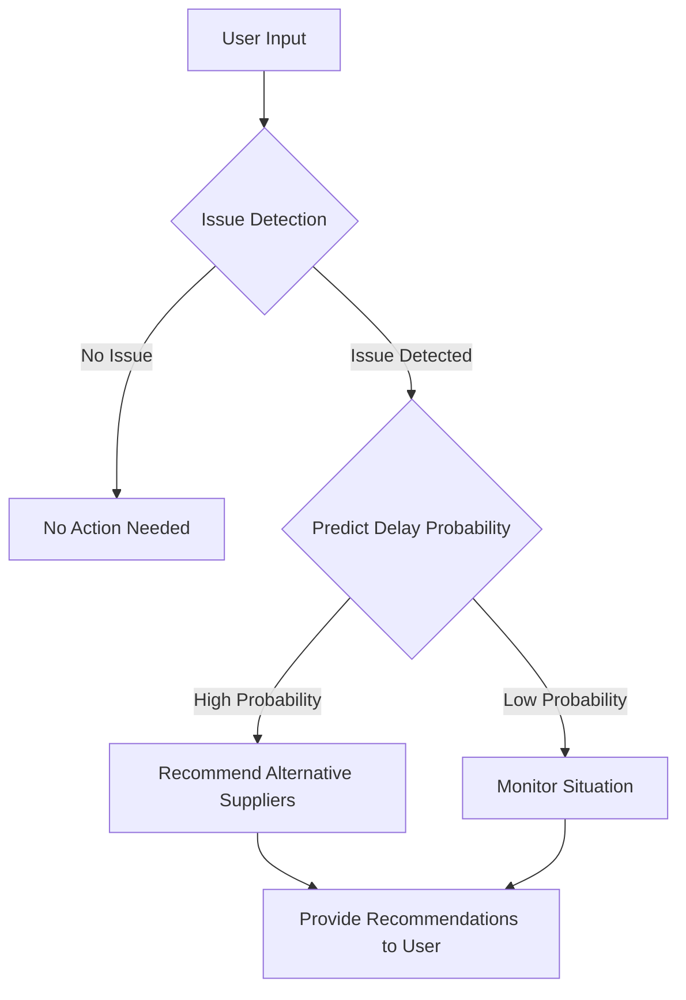

# ONDC Defensive AI

This is a Flask-based application designed to provide early warnings for potential supply chain issues and recommend alternative suppliers. The application leverages a fine-tuned BERT model for text classification to detect issues and uses statistical methods to predict the probability of delays.

## Features

- **Issue Detection**: Uses a BERT model to classify textual descriptions of supply chain events and detect potential issues.
- **Delay Prediction**: Calculates the probability of delays based on historical delivery data using a gamma-Poisson distribution.
- **Alternative Supplier Recommendation**: Recommends alternative suppliers if an issue is detected.
- **Buyer Interface**: Allows buyers to check the status of their orders.
- **Seller Interface**: Allows sellers to update their inventory.

## Algorithmic Logic

### 1. Issue Detection with BERT

- **Input**: Text description of a supply chain event.
- **Process**: Tokenize the input text using BERT tokenizer and classify it using a fine-tuned BERT model.
- **Output**: Predicted class (0 for no issue, 1 for issue).

### 2. Delay Probability Prediction

- **Input**: Historical delivery times for a supplier.
- **Process**:
  1. Fit a gamma distribution to the delivery times.
  2. Calculate the mean delivery time.
  3. Use a Poisson distribution to predict the delay probability.
- **Output**: Probability of a delay.

### 3. Alternative Supplier Recommendation

- **Input**: Current supplier name.
- **Process**: Exclude the current supplier from the list and randomly select alternative suppliers.
- **Output**: List of alternative suppliers.

### 4. External Factor Simulation

- **Input**: External factors such as weather conditions, logistics issues, or inventory status.
- **Process**: Adjust delay probability and recommendations based on the selected external factor.
- **Output**: Adjusted delay probability and recommendations.

## System Design

The system is designed with the following components:

1. **Web Interface**: Built with Flask, providing forms for users to input data and view results.
2. **Machine Learning Model**: A fine-tuned BERT model for text classification.
3. **Statistical Analysis**: Using gamma and Poisson distributions to predict delays.
4. **Database**: CSV files to simulate supplier and delivery data.
5. **Recommendation Engine**: Logic to recommend alternative suppliers based on current supplier performance and external factors.


### Diagrammatic System Design



## Installation

1. **Clone the repository**:
    ```bash
    git clone https://github.com/yourusername/supply-chain-alert-system.git
    cd supply-chain-alert-system
    ```

2. **Create and activate a virtual environment**:
    ```bash
    python3 -m venv venv
    source venv/bin/activate  # On Windows, use `venv\Scripts\activate`
    ```

3. **Install the dependencies**:
    ```bash
    pip install -r requirements.txt
    ```

4. **Run the application**:
    ```bash
    python app.py
    ```

## Usage

1. **Home Page**:
    - Enter the text description of a supply chain issue.
    - Enter the current supplier's name.
    - Select an external factor that might impact the supply chain (e.g., weather, logistics issues).
    - Click on "Analyze" to get the analysis results.

2. **Buyer Interface**:
    - Enter the Order ID to check the status of an order.
    - Click on "Check Order Status" to see the result.

3. **Seller Interface**:
    - Click on "Update Inventory" to simulate updating inventory.

## Data Files

- **suppliers.csv**: Contains information about suppliers, including location, rating, average delivery time, reliability score, maximum capacity, and other factors.
- **delivery_data.csv**: Contains historical delivery data, including order ID, product ID, supplier, delivery time, order quantity, delivery status, delay reason, and other factors.

## Docker

To run the application using Docker:

1. **Build the Docker image**:
    ```bash
    docker build -t supply-chain-alert .
    ```

2. **Run the Docker container**:
    ```bash
    docker run -p 4000:80 supply-chain-alert
    ```

## License

This project is licensed under the MIT License.